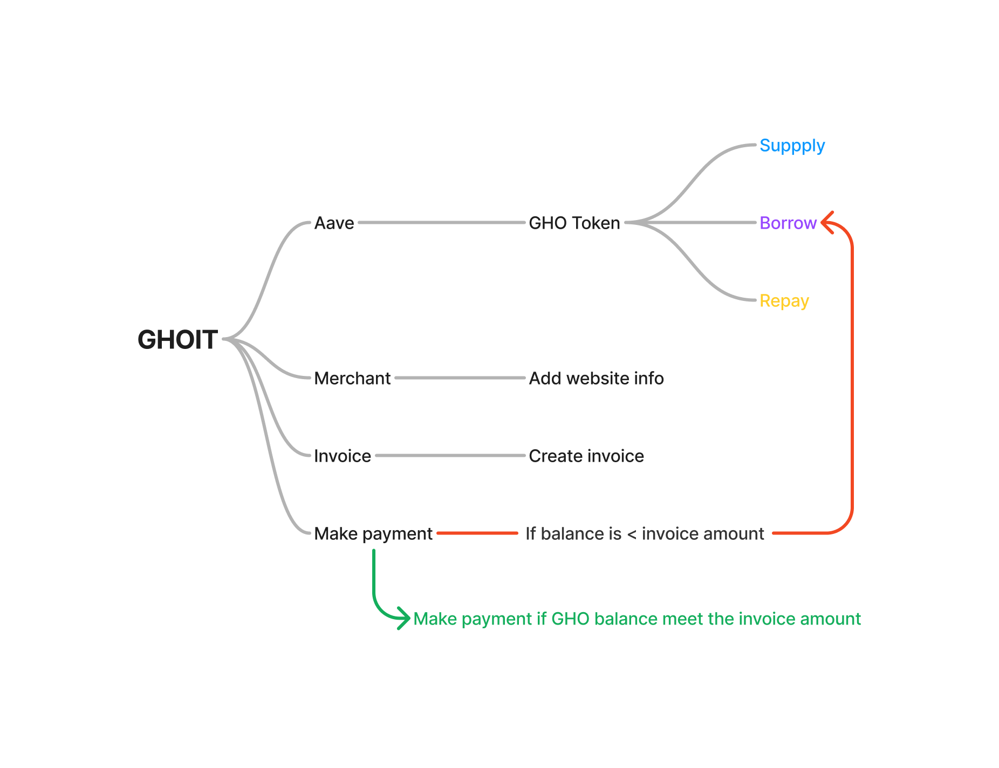

# GHOIT
The gateway to a world of secure and transparent transactions, connect, create, and make payment.

With GHO all platforms can create invoice and redirect users to GHOIT payment gateway to pay it. The website could be a shopping platform or a donation platform.

# Demo
https://ghoit.xyz

# Workflow

# Aave
Aave is a decentralized non-custodial liquidity protocol where users can participate as depositors or borrowers. Depositors provide liquidity to the market to earn a passive income, while borrowers are able to borrow in an overcollateralized (perpetually) or undercollateralized (one-block liquidity) fashion. This Portal links to the key resources on Aave to understand the fundamentals of the Protocol. Please join the discussion on Aave community Discord server; our team and members of the community look forward to helping you build on top of Aave.

# GHO
GHO is a decentralized overcollateralized stablecoin that is initially only minted from assets supplied to the Aave Protocol. GHO’s value is programmatically aligned to the U.S. Dollar, which will be maintained through market efficiency.

As a decentralized stablecoin on the Ethereum Mainnet, GHO is minted by users. As with all borrowing on the Aave Protocol, a user must supply collateral (at a specific collateral ratio) to be able to mint GHO. Correspondingly, when a user repays a borrow position (or is liquidated), the GHO is returned to the Aave pool and burned. All the interest payments accrued by minters of GHO will go directly to the Aave DAO treasury, in contrast to the standard reserve factor collected when users borrow other assets, and the principal is burned.

# Features
- Create merchant
- Send invoices
- Supply token on Aave
- Borrow GHO from Aave
- Repay
- Make Payment
- A CMS to track your invoices with invoices' status

# TODO
- Support other tokens
- Showing statistics charts (visualization)